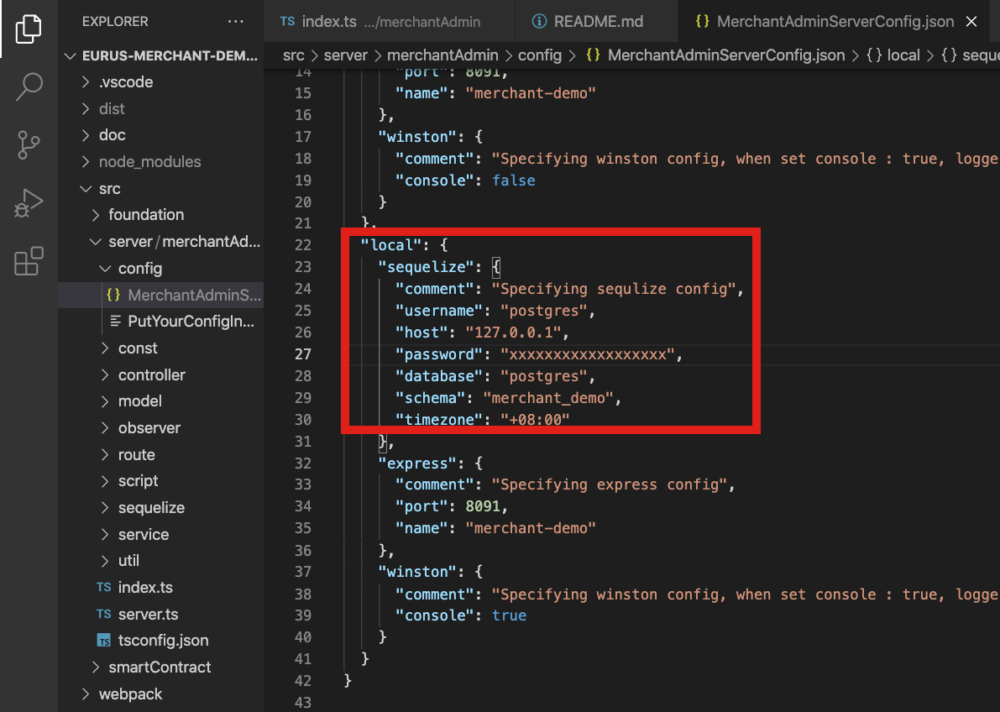

# eurus-merchant-demo-backend

# Requirement

- vscode
- node 14.17.3
- prettier (Optional)
- eslint (Optional)
- npm
- postman (Optional)
- postgreSQL

# Development

0. Change the database config in eurus-merchant-demo-backend/src/server/merchantAdmin/config/MerchantAdminServerConfig.json
   

1. Get the projects from https://github.com/eurus-chain/eurus-merchant-demo-backend
2. type node -v to check node version, the version should be 14.17.3

```terminal
   node -v
```

3. Once the version is correct, type npm install

```terminal
   npm install
```

4. node_modules should now appear on your projects folder

5. From the [Run and Debug] sections in visual studio code, choose **[Local] Init DB** to create sample DB

6. From the [Run and Debug] sections in visual studio code, choose **[Local] Merchant Admin Server** to run the api project


# Debugging

- **In the Debugger menu, there is few default program setup to run to program**
- **[Local]** MerchantAdmin Server, Run the merchantAdmin API server with database config of **[local]** environment specify in src/server/merchantAdmin/config/MerchantAdminServerConfig.json
- **[Dev]** MerchantAdmin Server, Run the merchantAdmin API server with database config of **[dev]** environment specify in src/server/merchantAdmin/config/MerchantAdminServerConfig.json
- **[Local]** Init DB, init the database by the sequelize model specify in src/general/model/seqModel, this files will run src/script/CreateTable, which will force update database column definition as those defined in src/general/model/seqModel

**For more information .vscode/launch.json to see what scripts will be run by debugger**

# Deployment

**In the project folders:**

1. Build the projects

```terminal
   npm run build
```

2. Run the built files

```terminal
   npm run dev              // Run in dev db (based on MerchantAdminServerConfig.json)
   npm run local            // Run in local db
```

5. Use pm2 log to check server status

```terminal
   ./node_modules/.bin/pm2 log
```

# Build Process

1. **[npm run build]**

- Build all servers (by default, this command will run **[npm run tscAll]**,**[npm run wpDev]**,**[npm run cpPublic]**)

2. **[npm run tscAll]**

   - will compile all typescript files to js files and put in **[dist/tsc/build]** folder
   - it use the following tsconfig.json for compile process

   * tsconfig.json
   * src/server/merchantAdmin/tsconfig.json

3. **[npm run wpDev]**

   - will bundle all dist/tsc/build server files into separate server bundle (Each server will be bundled into 1 js file, bundle.js)
   - the bundled files will be put in dist/webpack/dev
   - the bundled files will be using **[dev]** environment
   - it use the following webpack.js(s) for bundle process

   * webpack/merchantAdmin/merchantAdmin.dev.js

4. **[npm run wpLocal]**

   - will bundle all dist/tsc/build server files into separate server bundle (Each server will be bundled into 1 js file, bundle.js)
   - the bundled files will be put in dist/webpack/local
   - it use the following webpack.js for bundle process
   - the bundled files will be using **[local]** environment

   * webpack/merchantAdmin/merchantAdmin.local.js

5. **[npm run dev]**

   - will kill all pm2 process
   - and run each bundle.js of different server built from step (1) from **[dist/webpack/dev]** folders by pm2

6. **[npm run local]**

   - will kill all pm2 process
   - and run each bundle.js of different server built from step (1) from **[dist/webpack/local]** folders by pm2

# Useful command:

1. Access log from pm2

```terminal
   ./node_modules/.bin/pm2 log
```

2. Install node_modules

```terminal
   npm install
```

3. npm scripts
   
